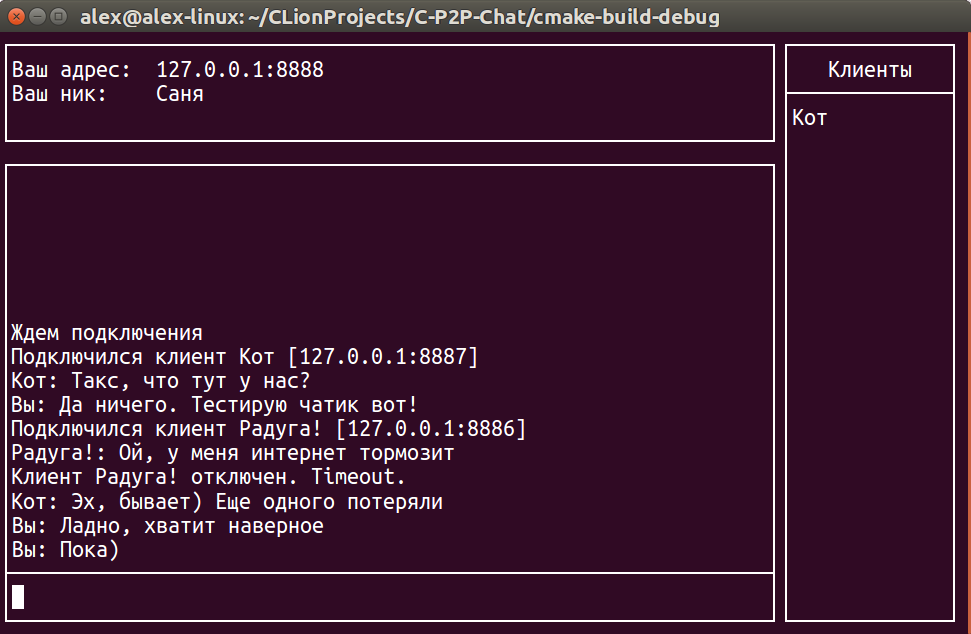

# C P2P Chat

**English** | [Русский](docs/README.ru.md)

[](https://github.com/gistrec/C-P2P-Chat/actions/workflows/build.yml)

A decentralized peer-to-peer chat written in C, built on top of UDP with non-blocking I/O.

Features:
- Connect to a single peer and the chat automatically discovers and joins the rest of the network.
- Activity tracking — peers that stop answering pings are considered disconnected.
- Pseudo-graphical Midnight Commander–style interface.
- Per-user nicknames.



---

## Dependencies
- [ncurses](https://www.gnu.org/software/ncurses/) — terminal I/O library (the wide-character build, `ncursesw`, is required).
- [CMake](https://cmake.org/) ≥ 3.10.

## Build

```bash
git clone --depth=1 https://github.com/gistrec/C-P2P-Chat.git
cd C-P2P-Chat
cmake -S . -B build
cmake --build build -- -j 2
```

### Installing dependencies

**Ubuntu / Debian:**
```bash
sudo apt-get install cmake libncursesw5-dev
```

**macOS (Homebrew):**
```bash
brew install cmake ncurses
```

More details: [installing ncurses](docs/ncurses.md), [installing CMake](docs/cmake.md).

## Usage

| Flag | Description |
| ---- | ----------- |
| `-n`, `--name <nick>` | Nickname (**required**) |
| `-l`, `--local-port <port>` | Local port (default `8888`) |
| `-r`, `--remote-host <ip>` | IP of a peer to connect to |
| `-p`, `--remote-port <port>` | Peer port (default `8888`) |
| `-h`, `--help` | Show usage |

Example:
```bash
./build/C_P2P_Chat --name Alice --remote-host 46.180.227.50 --remote-port 8888 --local-port 8080
```

## Roadmap
- Chat commands.
- Color support.
